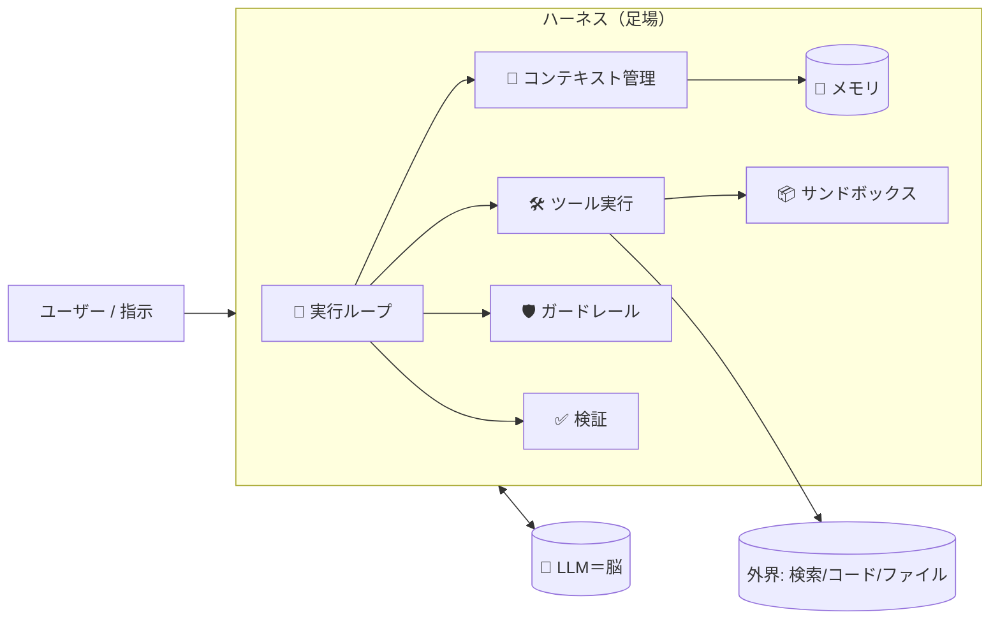

# 🧠×🛠️ ハーネスエンジニアリング入門 — 「モデルではなく“まわり”を設計する」(前半)＋学習ツール紹介

> 対象読者：これから **ハーネスエンジニアリング（Harness Engineering）** を学びたい人／AIエージェントを「動くもの」にしたい新人〜中堅エンジニア
> 想定タグ：`AI` `LLM` `Agent` `プロンプトエンジニアリング` `初心者`

この記事は2部構成です。

- **前半**：ハーネスエンジニアリングって何？（概念をやさしく）
- **後半**：学習用の無料ツール紹介（単体HTML・オフラインで動く「ハーネス学習」教室）

> 📌 **ウソなくの約束**：確認できた事実と、私（うさうさ先生）の所感を分けて書きます。数値は一次情報の確認を推奨し、二次情報には「※二次情報」と明記します。

---

## 前半：ハーネスエンジニアリングとは

### ひとことで言うと

> **モデル＝脳。ハーネス＝手・体・道具。**

LLM（大規模言語モデル）は、テキストを入れるとテキストを返すだけの存在です。単体では**記憶もループもなく**、ツールを「使いたい」と言えても**実際に実行する手段を持ちません**。

その“まわり”——実行ループ、ツール呼び出し、コンテキスト（文脈）管理、メモリ、ガードレール、トレース——をまとめて **ハーネス（harness／scaffolding）** と呼びます。そして、その足回りを**意図して設計する技術**が **ハーネスエンジニアリング** です。

近年は **「Agent = Model + Harness」** という捉え方が広がっています。

### 語源：テストの「ハーネス」から

「ハーネス」という言葉は、もともとソフトウェアテストの **テストハーネス**（対象を決まった条件でセットアップ・実行・評価する足場）から来ています。AIエージェントでは、**モデルに情報をどう渡し／どんなツールを持たせ／エラーをどう扱い／次に何をするかをどう決めるか**、その“足場”全体を指します。

### ハーネスの主な構成要素

| 要素 | 役割 | ざっくり例 |
|---|---|---|
| 🔁 実行ループ | 観測→思考→行動 を回す | 出力を解析して次の一手を決める |
| 🛠️ ツール | 外界とやり取りする手 | 検索・コード実行・ファイル操作 |
| 🧩 コンテキスト管理 | 文脈を渡す／削る | 履歴の圧縮、必要情報の供給 |
| 🧠 メモリ | 状態の保持 | セッションを跨いだ記憶 |
| 🛡️ ガードレール | 安全・権限 | 危険操作の承認、最小権限 |
| ✅ 検証（verification） | 結果の確認 | テスト合否、答え合わせ |
| 📦 サンドボックス | 隔離された作業場 | 実環境を壊さない環境 |

> 🐣 **新人向けメモ**：「プロンプトを頑張ってるのに本番で崩れる」——よくあります。原因はプロンプトではなく、**ハーネスが足りない**ことが多いです。プロンプト設計はハーネスの“一部”という位置づけです。

### なぜ重要？ — 同じモデルでも結果が変わる

ここ最近の論調は、ざっくり **「プロンプトエンジニアリングから、ハーネスエンジニアリングへ」**。理由は単純で、**モデルを固定しても、ハーネスの設計しだいで成否が大きく変わる**からです。

> ※二次情報：あるブログ記事は、スタンフォード／清華大の研究として「**同一モデルでもハーネス設計で最大6倍の性能差**」が出たと紹介しています。数値は **一次情報（原論文）の確認を推奨**します。ここで大事なのは「桁で変わりうる」という質的な事実です。

> 🦅 **中堅向けメモ**：いま現場の関心は、無秩序なマルチエージェントより **境界の明確な決定論的ワークフロー**（スーパーバイザ型、フェーズゲート、human-on-the-loop）に寄っています。長時間タスクでは、**コンテキストの劣化（context rot）** を抑える設計（履歴の圧縮、トレース、状態の永続化）が効きます。

### 🍜 ラーメン店でたとえると（※不正確なたとえ）

- **モデル** ＝ 天才肌の料理人（味の決定はピカイチ）
- **ハーネス** ＝ 厨房・導線・オーダー票・在庫・衛生ルール
- 同じ料理人でも、**厨房がぐちゃぐちゃ（ハーネス未整備）なら注文はさばけません**。逆に厨房を整えるだけで、提供スピードも品質も跳ね上がります。

> ※これは理解のためのたとえで、正確な定義ではありません。

### 全体像（mermaid）



---

## 後半：手を動かして学ぶ — 無料の「ハーネス学習」ツール

概念は読むだけだと定着しにくいので、**学習用ツール**を作りました。うさうさ研修工房の「まるごとスイート PRO」に入っている **🧠 ハーネス学習教室** です。

> 事実：**単体HTML・外部依存ゼロ・オフライン対応**。ダウンロードしてブラウザで開くだけで動きます（インストール不要）。

### このツールでできること

- ハーネスの**構成要素を分解して理解**する
- 学んだことを**自分の言葉で説明する練習**（AIが“説明の先生”になって壁打ち）
- 図解PPT教室・論文教室と連携して、**説明→図解→裏取り**まで一気通貫

### 学習用の“型”：H = E + T + C + S + L + V（※うさうさ流）

標準仕様ではなく、**覚えやすくするための分解**です。

| 記号 | 意味 | キーワード |
|---|---|---|
| **E** | Environment（環境/サンドボックス） | 隔離された作業場 |
| **T** | Tools（ツール） | 外界とつながる手 |
| **C** | Context（コンテキスト管理） | 渡す／削る／圧縮 |
| **S** | System（システムプロンプト/ガードレール） | 振る舞いと安全 |
| **L** | Loop（実行ループ） | 観測→思考→行動 |
| **V** | Verification（検証） | テスト・答え合わせ |

> 🐣 **新人向け**：まずは E〜V を1つずつ「これは何のためにある？」と言えるようにするのがゴール。
> 🦅 **中堅向け**：自分の担当プロダクトで、E〜V のどこが弱いか（例：C＝context rot、V＝検証が無い）を棚卸しすると、改善点が一気に見えます。

### 使い方（3ステップ）

```text
1. スイートを開く → 🧠 まなびの島（ハーネス学習教室）を選ぶ
2. E〜V を順に学び、「自分の言葉」で説明を書く
3. AI説明トレーナーに壁打ち（任意・APIキー設定時）→ 図解/論文教室で裏取り
```

> ⚠️ **注意**：AIに相談する機能はローカルでは自分のAPIキーが必要です。キーは端末のブラウザ内のみに保存され、**共有PCでは使用後に必ず「クリア」**してください。AIが出したURLや文章は**人によるレビュー前提**で使いましょう。

### この形にした理由（所感）

- **配布が1ファイル**だと、研修や勉強会でそのまま渡せて、オフラインでも開けます。
- **「人ではなく仕組み」**——保存もログも仕組み側で拾う設計にして、環境差に強くしています。
- 概念（前半）と手触り（後半）が**同じ場所**にあると、学習が早いと感じています。

---

## まとめ

- ハーネスエンジニアリングは「**モデルではなく“まわり”を設計する**」技術。要素は **ループ／ツール／コンテキスト／メモリ／ガードレール／検証／サンドボックス**。
- **同じモデルでもハーネスで成否が変わる**（数値は一次情報で確認推奨／桁で変わりうるのは確か）。
- 学ぶときは **E〜V を1つずつ説明できる**ように。手を動かすなら無料の学習ツールをどうぞ。

退屈になりがちな“足場づくり”も、工夫しだいで楽しく学べます——

> **面白きこともなき世を面白く。**（高杉晋作）　🐰🌊 うさうさ先生

---

## 参考リンク（※一次情報の確認を推奨）

- Hugging Face: AI agent glossary（model／harness／scaffold などの整理）
- GitHub: awesome-harness-engineering（ハーネス設計の資料・パターン集）
- 解説記事（Agent Harness Engineering／What is Harness Engineering など、2026年）
- arXiv: コーディングエージェントのscaffolding/harness/context engineering に関する論文

> ※本記事の用語整理は上記のような公開資料に基づきます。具体的な性能数値（例：最大6倍）は二次情報のため、原典での確認をおすすめします。
